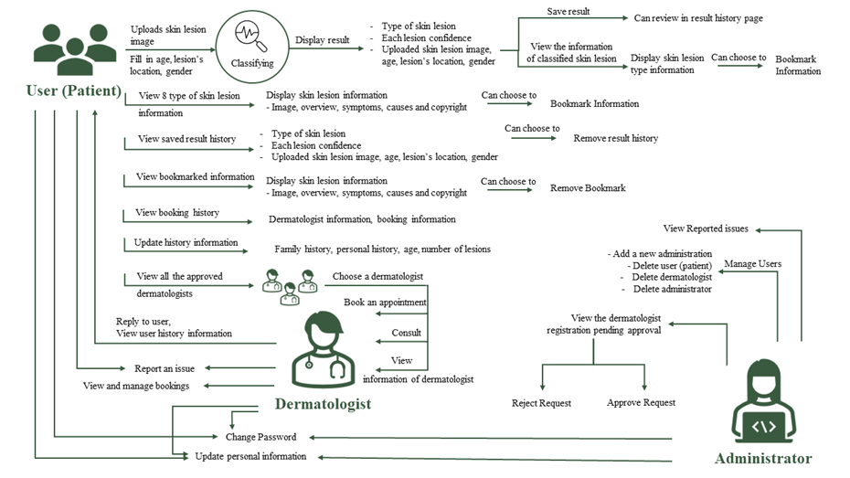
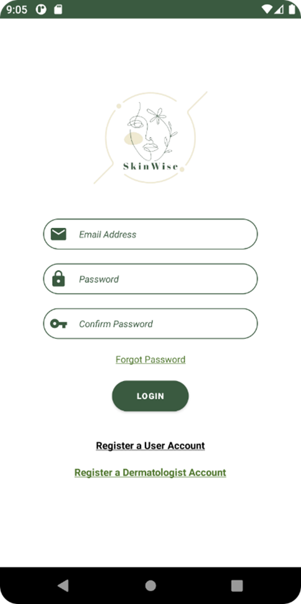
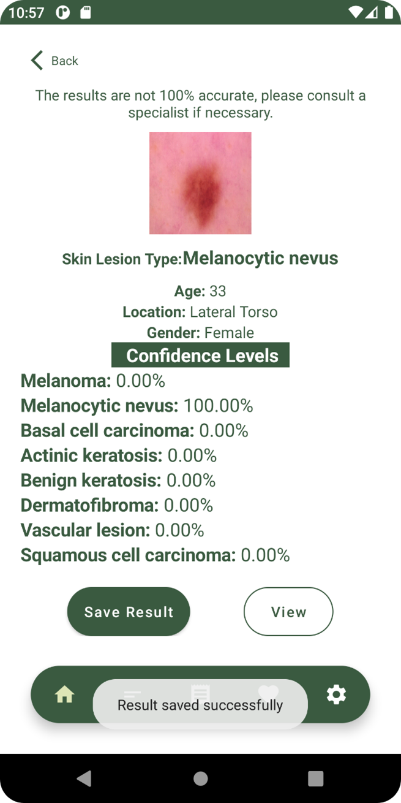
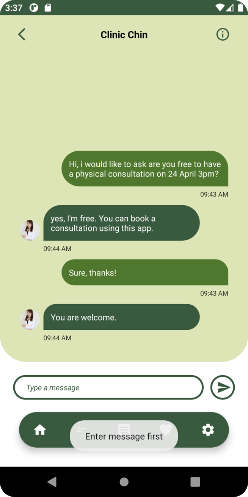

# SkinWise: AI-Powered Skin Disease Diagnosis with Consultation

SkinWise is a user-interactive mobile application that leverages Artificial Intelligence to identify common skin lesions and connect users with dermatologists for remote consultation. Developed using a Convolutional Neural Network (CNN) integrated with telemedicine functionalities, the system aims to increase accessibility to early dermatological diagnosis, especially in underserved or rural areas.

## 🔍 Project Overview

This application allows users to:
- Upload or capture images of their skin lesions.
- Receive AI-based predictions for 8 common types of skin lesions.
- Save diagnostic results for historical reference.
- Access information about each lesion type.
- Book consultations with certified dermatologists.
- Receive tailored insights and educational content.

Dermatologists and administrators also have custom roles for interaction, consultation, and system management.

## 📱 Features

### For Users:
- AI-powered diagnosis using a CNN model trained on ISIC dataset.
- Real-time image capture and upload.
- Result history and bookmark functionality.
- In-app consultation and messaging with dermatologists.

### For Dermatologists:
- Registration and account approval process.
- Patient history review and consultation management.
- Booking filters and response system.

### For Administrators:
- Manage dermatologist approvals.
- Oversee reported issues and system users.
- Secure account management.

## 🛠️ Technologies Used

- **Mobile App**: Java, Android Studio, Firebase (Auth, Realtime Database, Storage)
- **AI Model**: TensorFlow/Keras, CNN, MobileNetV2, Transfer Learning
- **Backend Tools**: Python, NumPy, Pandas, Matplotlib, Seaborn, Scikit-learn
- **Libraries**: SSD, SSP, RoundImageView, RecyclerView

## 🧠 AI Model Details

The skin lesion classifier is trained using MobileNetV2 with transfer learning. It classifies the following 8 types of lesions:
1. Actinic Keratosis
2. Basal Cell Carcinoma
3. Dermatofibroma
4. Melanocytic Nevus
5. Melanoma
6. Seborrheic Keratosis
7. Squamous Cell Carcinoma
8. Vascular Lesion

## 📸 Screenshots

<h3>Login Page</h3>

<h3>Diagnosis Result</h3>

<h3>Consultation</h3>

## 🧪 Testing & Evaluation

- **Unit Testing** and **User Acceptance Testing (UAT)** were conducted with detailed results discussed in the project report.
- The CNN model achieved high performance across several evaluation metrics.
- The application interface and logic were validated through iterative feedback.

## ⚖️ License

This project is developed for academic and educational purposes. Please contact the author for usage permissions outside of these bounds.

## 🙋‍♀️ Author

**Khor You Qi**  

LinkedIn: https://www.linkedin.com/in/khor-you-qi-tracy/
---

> 📝 *SkinWise is aligned with SDG 3: Good Health and Well-being — making medical diagnostics more accessible and inclusive worldwide.*

